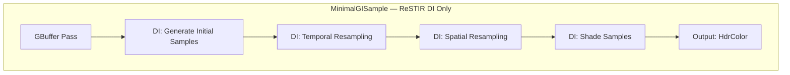
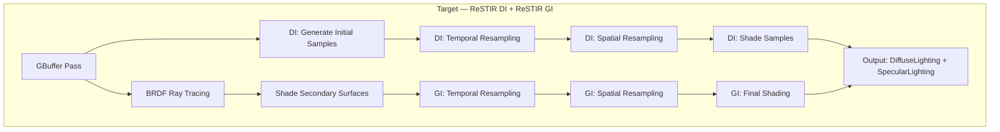
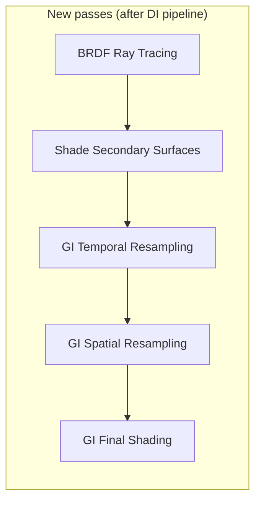
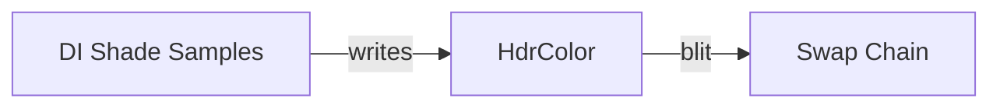
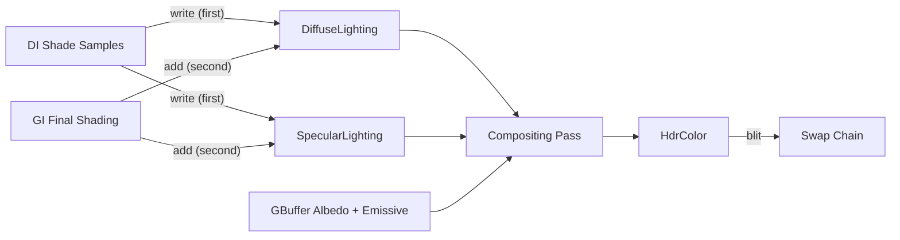
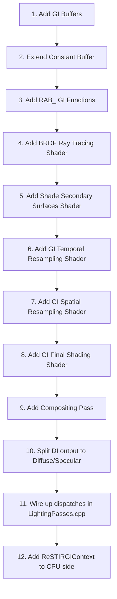

# Adding ReSTIR GI to MinimalGISample — Technical Analysis

## 1. Overview: ReSTIR DI vs ReSTIR DI + GI

**ReSTIR DI** (Direct Illumination) resamples *light sources* at the primary visible surface.
Each pixel picks a light, evaluates its contribution, and shares/reuses that choice with
neighbors and across frames through reservoir-based importance resampling.
The result is high-quality **direct** lighting with very few shadow rays.

**ReSTIR GI** (Global Illumination) extends the same reservoir resampling idea to
**indirect** lighting. Instead of resampling light sources, it resamples
*secondary-surface radiance samples* — the radiance arriving from a BRDF-guided bounce ray.
By sharing these indirect samples across pixels and frames, ReSTIR GI produces
temporally-stable indirect illumination at interactive rates.

When combined, ReSTIR DI handles direct lighting and ReSTIR GI handles one-bounce
indirect lighting. Both write into the same diffuse/specular lighting textures, and
compositing is unchanged.

### High-level pipeline comparison





---

## 2. What Can Be Reused As-Is from MinimalGISample

| Component | Reusable? | Notes |
|-----------|-----------|-------|
| **GBuffer pass** (shader + dispatch) | Yes | Unchanged — primary surface data is needed by both DI and GI |
| **DI: Generate Initial Samples** | Yes | Unchanged |
| **DI: Temporal Resampling** | Yes | Unchanged |
| **DI: Spatial Resampling** | Yes | Unchanged |
| **DI: Shade Samples** | Yes | Writes to `DiffuseLighting`/`SpecularLighting`; GI adds to same textures |
| **PrepareLightsPass** | Yes | Light buffer is also used when shading secondary surfaces with DI |
| **RtxdiResources** (DI buffers) | Yes | `LightReservoirBuffer`, `LightDataBuffer`, `NeighborOffsetsBuffer`, etc. all stay |
| **RenderTargets** (GBuffer textures) | Yes | Current/previous GBuffer pairs needed for GI temporal reprojection too |
| **RAB_ bridge functions** | Mostly | Most functions are shared. Two need additions (see Section 5) |
| **Binding layout** | Needs extension | Additional UAV slots for GI reservoir buffer and secondary GBuffer |
| **Constant buffer** | Needs extension | Must add `ReSTIRGI_Parameters` block |
| **`NextFrame()` swap logic** | Yes | GBuffer ping-pong stays the same |

---

## 3. Additional Buffers and Textures Needed

### New GPU Buffers

| Buffer | Type | Size | Purpose |
|--------|------|------|---------|
| **`GIReservoirBuffer`** | `RWStructuredBuffer<RTXDI_PackedGIReservoir>` | `reservoirArrayPitch × 2` (2 temporal slots) | Stores GI reservoirs across resampling passes and frames |
| **`SecondaryGBuffer`** | `RWStructuredBuffer<SecondaryGBufferData>` | `reservoirArrayPitch × 1` | Stores hit data from BRDF rays (position, normal, material, throughput, emission, PDF) |

### New Textures

| Texture | Format | Purpose |
|---------|--------|---------|
| **`DiffuseLighting`** | `RGBA16_FLOAT` | Replaces direct write to `HdrColor` — accumulates demodulated diffuse from both DI and GI |
| **`SpecularLighting`** | `RGBA16_FLOAT` | Accumulates specular from both DI and GI |

> **Note:** MinimalGISample currently writes final color directly into `HdrColor`. With GI, the
> pipeline needs split diffuse/specular textures so that DI shade and GI final shading can
> **additively** contribute, and a compositing step can re-modulate by albedo.

### GI Reservoir Structure (`RTXDI_GIReservoir`)

```hlsl
struct RTXDI_GIReservoir
{
    float3 position;    // World position of the secondary bounce surface
    float3 normal;      // Normal at the secondary surface
    float3 radiance;    // Incoming radiance from that surface
    float  weightSum;   // RIS weight sum → inverse PDF after finalization
    uint   M;           // Sample count
    uint   age;         // Temporal age in frames
};
```

Compare with **DI reservoir** which stores a light index + UV + visibility — GI reservoirs
store a **world-space radiance sample** because indirect lighting has no discrete light to index.

---

## 4. Additional Fields Needed in RTXDI / RAB Structs

### Constant Buffer Extensions

The `ResamplingConstants` (or equivalent) constant buffer needs a new block:

```hlsl
ReSTIRGI_Parameters restirGI;  // Contains:
    // RTXDI_ReservoirBufferParameters reservoirBufferParams
    // ReSTIRGI_BufferIndices          bufferIndices
    // ReSTIRGI_TemporalResamplingParameters temporalResamplingParams
    // ReSTIRGI_SpatialResamplingParameters  spatialResamplingParams
    // ReSTIRGI_FinalShadingParameters       finalShadingParams
```

Plus BRDF ray-tracing control fields:

```hlsl
uint enableBrdfIndirect;    // Master toggle for indirect path
uint enableReSTIRGI;        // Whether GI resampling is active
```

### SecondaryGBufferData Struct (New)

```hlsl
struct SecondaryGBufferData
{
    float3 worldPos;
    uint   normal;                  // Oct-encoded

    uint2  throughputAndFlags;      // Packed throughput + flags (specular/delta/envmap)
    uint   diffuseAlbedo;           // R11G11B10
    uint   specularAndRoughness;    // R8G8B8A8

    float3 emission;                // Emissive + direct radiance at secondary hit
    float  pdf;                     // BRDF PDF for the initial GI sample
};
```

### RAB_Buffers.hlsli Extensions

New buffer declarations in the bridge:

```hlsl
RWStructuredBuffer<RTXDI_PackedGIReservoir>  u_GIReservoirs;       // e.g. register(u6)
RWStructuredBuffer<SecondaryGBufferData>      u_SecondaryGBuffer;   // e.g. register(u7)

#define RTXDI_GI_RESERVOIR_BUFFER u_GIReservoirs
```

---

## 5. Additional RAB_ Bridge Code Needed for GI

Most existing `RAB_` functions are shared between DI and GI. Two functions require
**GI-specific implementations** that the RTXDI library calls during GI resampling:

### `RAB_GetGISampleTargetPdfForSurface`

Called by all GI resampling passes to evaluate how good a GI sample is for a given surface.

```hlsl
float RAB_GetGISampleTargetPdfForSurface(float3 samplePosition, float3 sampleRadiance, RAB_Surface surface)
{
    // Evaluate BRDF at the primary surface for the direction toward the GI sample
    float3 L = normalize(samplePosition - surface.worldPos);
    SplitBrdf brdf = EvaluateBrdf(surface, samplePosition);
    float3 reflectedRadiance = sampleRadiance
        * (brdf.demodulatedDiffuse * surface.material.diffuseAlbedo + brdf.specular);
    return calcLuminance(reflectedRadiance);
}
```

### `RAB_ValidateGISampleWithJacobian`

Called during spatial resampling to validate sample reuse across pixels with a Jacobian
correction for the solid angle change.

```hlsl
bool RAB_ValidateGISampleWithJacobian(inout float jacobian, RAB_Surface neighborSurface, float3 samplePosition)
{
    // Compute Jacobian ratio: how the solid angle of the sample changes
    // when viewed from the neighbor pixel vs the original pixel.
    // Reject if the ratio is extreme (sample not reusable).
    // The RTXDI library provides RTXDI_CalculateJacobian() for this.
    return jacobian > 0 && jacobian < 10.0;
}
```

### Existing RAB_ Functions Used by GI (no changes needed)

The GI resampling shaders also call these existing functions — they work as-is:

- `RAB_GetGBufferSurface` — load primary surface for neighbor pixels
- `RAB_GetSurfaceNormal`, `RAB_GetSurfaceLinearDepth`, `RAB_GetSurfaceWorldPos`
- `RAB_GetMaterial`, `RAB_AreMaterialsSimilar`
- `RAB_IsSurfaceValid`, `RAB_EmptySurface`
- `RAB_GetNextRandom`, `RAB_InitRandomSampler`
- `RAB_ClampSamplePositionIntoView`
- `RAB_GetConservativeVisibility` (spatial), `RAB_GetTemporalConservativeVisibility` (temporal)

---

## 6. Additional Passes and Their Inputs/Outputs

### Pass Pipeline for ReSTIR GI



### Pass Details

#### Pass 1: BRDF Ray Tracing

| | |
|---|---|
| **Purpose** | Trace one BRDF-sampled bounce ray per pixel to find the secondary surface |
| **Dispatch** | Screen-space, `ceil(W/8) × ceil(H/8)` |
| **Inputs** | GBuffer (primary surface), TLAS, scene geometry/materials |
| **Outputs** | `SecondaryGBuffer` buffer (position, normal, material, throughput, emission, PDF) |
| **Key logic** | MIS lobe selection (diffuse vs specular via GGX VNDF), traces ray, records hit geometry + emissive, computes `overall_PDF` for GI reservoir creation |

#### Pass 2: Shade Secondary Surfaces

| | |
|---|---|
| **Purpose** | Apply direct lighting (via ReSTIR DI initial sampling) to the secondary surface, then create the initial GI reservoir |
| **Dispatch** | Screen-space, `ceil(W/8) × ceil(H/8)` |
| **Inputs** | `SecondaryGBuffer`, `LightDataBuffer`, DI reservoirs (for optional secondary resampling), TLAS |
| **Outputs** | `GIReservoirBuffer[initialOutputIndex]` — initial GI reservoir per pixel; updated `SecondaryGBuffer.emission` with shaded radiance for MIS |
| **Key logic** | Samples lights at secondary surface, optionally resamples from primary DI reservoirs, creates `RTXDI_MakeGIReservoir(position, normal, radiance, pdf)` |

#### Pass 3: GI Temporal Resampling

| | |
|---|---|
| **Purpose** | Combine current frame's initial GI reservoir with the previous frame's resampled reservoir |
| **Dispatch** | Screen-space, `ceil(W/8) × ceil(H/8)` |
| **Inputs** | `GIReservoirBuffer[initialOutputIndex]`, `GIReservoirBuffer[temporalInputIndex]` (prev frame), GBuffer (current + previous), motion vectors |
| **Outputs** | `GIReservoirBuffer[temporalOutputIndex]` |
| **Key logic** | Motion-vector reprojection, surface similarity test, `RTXDI_GITemporalResampling()`, optional boiling filter |

#### Pass 4: GI Spatial Resampling

| | |
|---|---|
| **Purpose** | Share GI reservoirs with neighboring pixels |
| **Dispatch** | Screen-space, `ceil(W/8) × ceil(H/8)` |
| **Inputs** | `GIReservoirBuffer[spatialInputIndex]`, GBuffer, neighbor offsets |
| **Outputs** | `GIReservoirBuffer[spatialOutputIndex]` |
| **Key logic** | `RTXDI_GISpatialResampling()` with depth/normal/material similarity tests, Jacobian correction |

#### Pass 5: GI Final Shading

| | |
|---|---|
| **Purpose** | Convert the resampled GI reservoir into actual diffuse/specular lighting at the primary surface |
| **Dispatch** | Screen-space, `ceil(W/8) × ceil(H/8)` |
| **Inputs** | `GIReservoirBuffer[finalInputIndex]`, `SecondaryGBuffer` (for MIS with initial sample), GBuffer, TLAS (for optional final visibility) |
| **Outputs** | `DiffuseLighting`, `SpecularLighting` (additive) |
| **Key logic** | Evaluate BRDF at primary surface toward the reservoir's secondary position, optional visibility ray, optional MIS between resampled and initial sample, `StoreShadingOutput()` |

### Summary Table

| Pass | Shader | Reads | Writes |
|------|--------|-------|--------|
| BRDF Ray Tracing | `BrdfRayTracing.hlsl` | GBuffer, TLAS, materials | `SecondaryGBuffer` |
| Shade Secondary Surfaces | `ShadeSecondarySurfaces.hlsl` | `SecondaryGBuffer`, `LightDataBuffer`, TLAS | `GIReservoirBuffer`, `SecondaryGBuffer` |
| GI Temporal Resampling | `GI/TemporalResampling.hlsl` | `GIReservoirBuffer` ×2, GBuffer ×2, MotionVectors | `GIReservoirBuffer` |
| GI Spatial Resampling | `GI/SpatialResampling.hlsl` | `GIReservoirBuffer`, GBuffer, NeighborOffsets | `GIReservoirBuffer` |
| GI Final Shading | `GI/FinalShading.hlsl` | `GIReservoirBuffer`, `SecondaryGBuffer`, GBuffer, TLAS | `DiffuseLighting`, `SpecularLighting` |

---

## 7. Is Light Presampling (ReGIR) Needed?

**No, ReGIR is optional.** It is not required for either ReSTIR DI or ReSTIR GI.

ReGIR (Reservoir-based Grid Importance Resampling) is an optimization for **initial light
sampling** that builds a world-space grid of pre-selected lights. It improves the quality
of the initial DI samples when there are many lights, but the core DI and GI algorithms
work without it.

In fact:
- **MinimalGISample** does not use ReGIR — it uses uniform light sampling in the DI initial
  sampling pass and works correctly.
- **IntermediateSample** uses ReGIR as an optional mode (`ReSTIRDI_LocalLightSamplingMode::ReGIR_RIS`).
- ReGIR is used when shading secondary surfaces too (to pick better lights at the bounce point),
  but the secondary DI sampling also works without it — just with potentially noisier initial
  light selection.

**Recommendation:** Skip ReGIR for the initial MinimalGISample + GI implementation. It can
be added later as an optimization.

---

## 8. How Compositing Differs

### MinimalGISample (Current — DI Only)

The `DIShadeSamples` pass writes final lit color directly into `HdrColor`, which is then
blitted to the swap chain. There is no separate compositing step.



### With ReSTIR GI (Target)

Multiple passes contribute lighting (DI shade + GI final shading), so we need:

1. **Split output textures**: `DiffuseLighting` and `SpecularLighting` (both `RGBA16_FLOAT`)
2. **Additive writes**: DI shade writes first (`isFirstPass = true`), GI final shading adds
   (`isFirstPass = false`)
3. **Compositing pass** that re-modulates and combines:

```hlsl
float3 color = diffuseLighting * diffuseAlbedo + specularLighting + emissive;
```



The compositing shader reads the demodulated diffuse, multiplies by the albedo from the
GBuffer, adds specular (already modulated), adds emissive, and writes to `HdrColor`.

This is the same approach used in IntermediateSample's `CompositingPass.hlsl`.

---

## 9. CPU-Side Context Management

### New Context: `ReSTIRGIContext`

The RTXDI library provides `ImportanceSamplingContext` which manages both
`ReSTIRDIContext` and `ReSTIRGIContext` together. Alternatively, a standalone
`ReSTIRGIContext` can be created:

```cpp
rtxdi::ReSTIRGIStaticParameters giStaticParams;
giStaticParams.RenderWidth = renderWidth;
giStaticParams.RenderHeight = renderHeight;
auto giContext = std::make_unique<rtxdi::ReSTIRGIContext>(giStaticParams);
```

Each frame:

```cpp
giContext->SetFrameIndex(frameIndex);
giContext->SetResamplingMode(rtxdi::ReSTIRGI_ResamplingMode::TemporalAndSpatial);
// Fill constant buffer with:
//   giContext->GetReservoirBufferParameters()
//   giContext->GetBufferIndices()
//   giContext->GetTemporalResamplingParameters()
//   giContext->GetSpatialResamplingParameters()
//   giContext->GetFinalShadingParameters()
```

The buffer indices rotate automatically based on `frameIndex`, similar to DI.

### GI Reservoir Buffer Sizing

```cpp
auto giReservoirParams = giContext->GetReservoirBufferParameters();
uint32_t giBufferSize = giReservoirParams.reservoirArrayPitch
                      * rtxdi::c_NumReSTIRGIReservoirBuffers;  // = 2
// Create: RWStructuredBuffer<RTXDI_PackedGIReservoir> of giBufferSize elements
```

---

## 10. Implementation Checklist



### Step-by-step

1. **Add `GIReservoirBuffer` and `SecondaryGBuffer`** to `RtxdiResources`
2. **Add `DiffuseLighting` and `SpecularLighting`** to `RenderTargets`
3. **Extend `ResamplingConstants`** with `ReSTIRGI_Parameters`, BRDF control fields, and `SecondaryGBufferData` struct in `ShaderParameters.h`
4. **Extend `RAB_Buffers.hlsli`** with `u_GIReservoirs`, `u_SecondaryGBuffer`, and `#define RTXDI_GI_RESERVOIR_BUFFER`
5. **Add `RAB_GetGISampleTargetPdfForSurface`** and **`RAB_ValidateGISampleWithJacobian`** to the bridge
6. **Create 5 new shader files**: `BrdfRayTracing.hlsl`, `ShadeSecondarySurfaces.hlsl`, `GI/TemporalResampling.hlsl`, `GI/SpatialResampling.hlsl`, `GI/FinalShading.hlsl`
7. **Create compositing shader** (or inline: read diffuse/specular, multiply by albedo, add emissive)
8. **Modify `DIShadeSamples.hlsl`** to write to `DiffuseLighting`/`SpecularLighting` instead of `HdrColor`
9. **Add `ReSTIRGIContext`** creation and per-frame update in `main.cpp` or `LightingPasses.cpp`
10. **Add compute pipeline creation and dispatch calls** for all new passes in `LightingPasses.cpp`
11. **Update binding set** to include new buffers as UAVs
12. **Update `main.cpp` render loop** to call the new passes after DI, blit composited result

---

## Appendix A: Key Library Header Includes for GI

```hlsl
// In GI shader files, include these from the RTXDI library:
#include <Rtxdi/GI/Reservoir.hlsli>             // GI reservoir struct + pack/unpack
#include <Rtxdi/GI/TemporalResampling.hlsli>    // RTXDI_GITemporalResampling()
#include <Rtxdi/GI/SpatialResampling.hlsli>     // RTXDI_GISpatialResampling()
#include <Rtxdi/GI/SpatioTemporalResampling.hlsli> // RTXDI_GISpatioTemporalResampling() (fused)
#include <Rtxdi/GI/BoilingFilter.hlsli>         // RTXDI_GIBoilingFilter() (optional)
```

## Appendix B: GI Reservoir Buffer Index Rotation

The `ReSTIRGIContext` manages 2 reservoir buffer slots (vs 3 for DI). Each frame,
`SetFrameIndex()` updates `BufferIndices`:

| Index field | Purpose |
|-------------|---------|
| `secondarySurfaceReSTIRDIOutputBufferIndex` | Where `ShadeSecondarySurfaces` writes initial reservoirs |
| `temporalResamplingInputBufferIndex` | Previous frame's output (for temporal reuse) |
| `temporalResamplingOutputBufferIndex` | Where temporal pass writes |
| `spatialResamplingInputBufferIndex` | Input to spatial pass |
| `spatialResamplingOutputBufferIndex` | Final resampled output |

These indices rotate automatically each frame so that temporal input always reads
the previous frame's spatial output.
